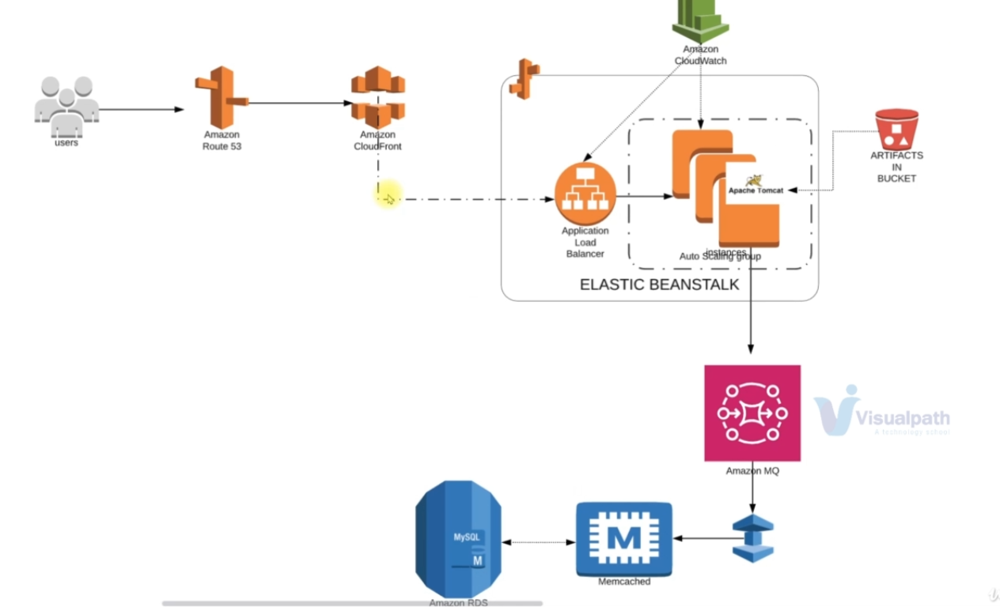
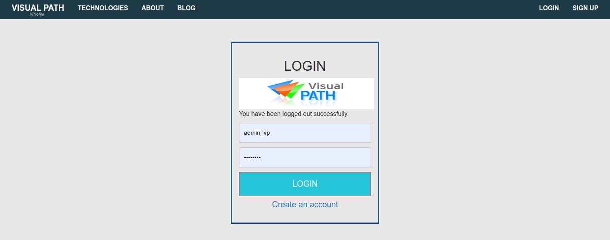
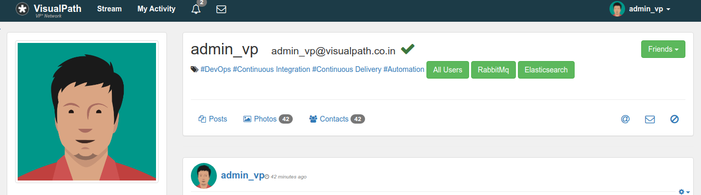

# ElasticBeanstalk-AmazonMQ-Elasticache-Route53-Project

1.Description

This Visual Profile Maven Project was created using ElasticBeanstalk, Amazon Elasticache-Memcached, AmazonMQ, AmazonRDS , AmazonS3, Amazon Route53 and Amazon Cloudfront 

2.Architecture of Project

3.Project Output

4.Project Profile Output

